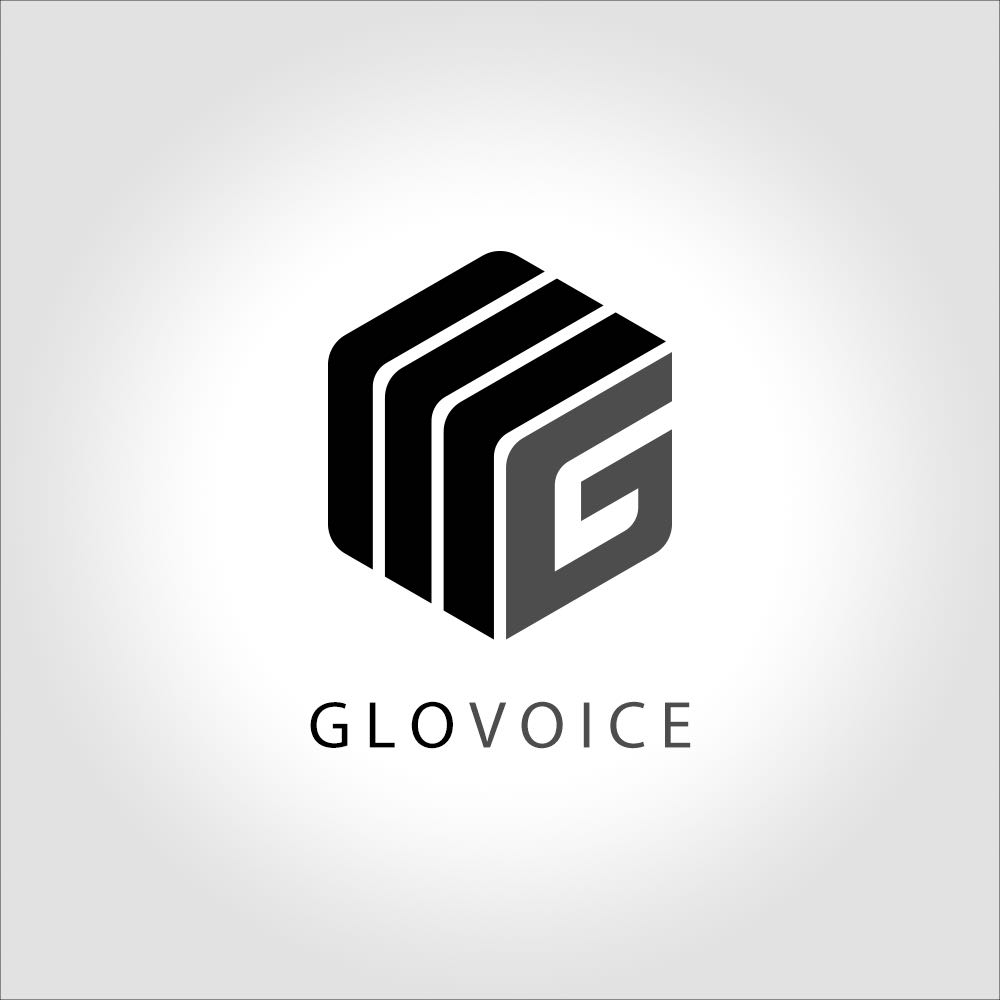
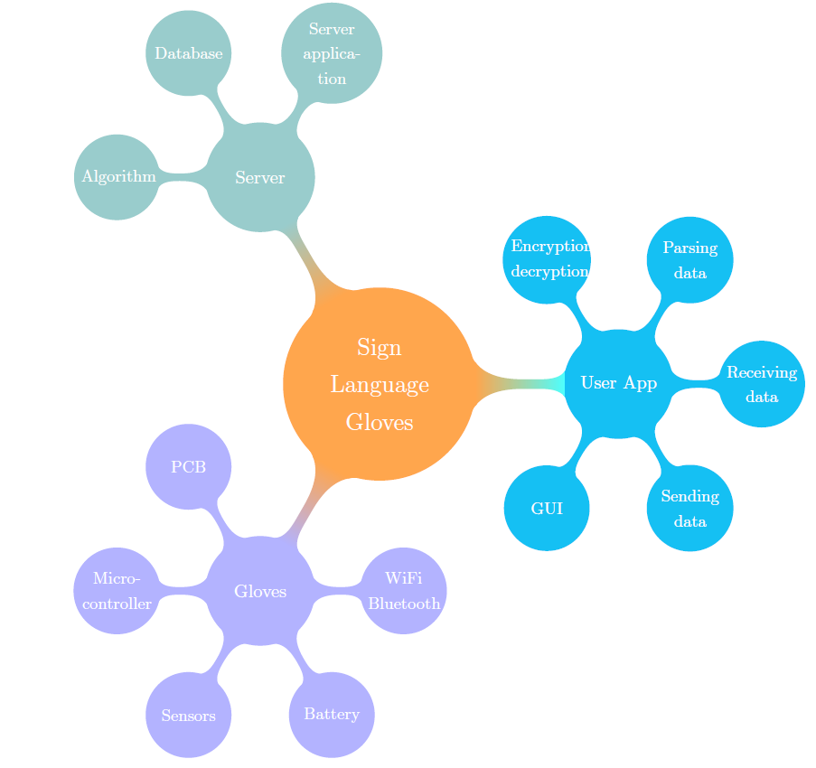
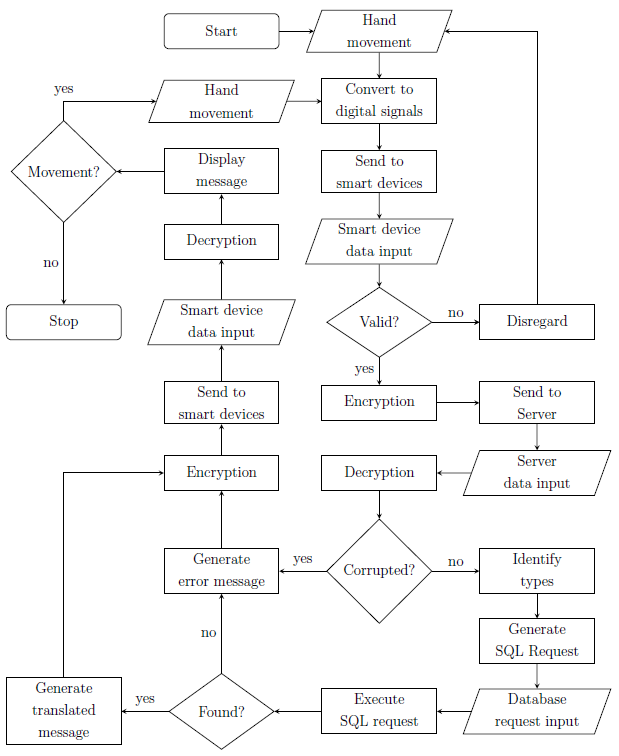

# Welcome to Project Glovoice

The project is about a pair of gloves that helps sign language users communicate smoothly with those who can speak, aiming at breaking the boundaries between the deaf and hearing people. Its main function is to display the translated sign language in words on a screen via an app or website.

## Problem Statement

Speaking and hearing, two of the most fundamental capabilities that a person may possess, can cast quite a problem for the physically challenged --- the mute and the deaf. In this technologically-fuelled era, there are many ways for those people to express their thoughts or feelings, i.e. by writing notes, emails and communicating via the social media, which of course is rather slow due to communication delays. Another means of communication would be by using the sign language. This, however, can pose a problem to these people of different nationalities, as different countries may have different sign languages.

## Market Research

According to "Deafness and hearing loss Fact sheet N°300"

“As of 2013 hearing loss affects about 1.1 billion people to some degree. It causes disability in 5% (360 to 538 million) and moderate to severe disability in 124 million people.”

The statistical data have proven that over 100 million people, which is more than 1% of the total population in the world, are suffering from hearing loss to different extents. Those with long-term hearing loss may choose to use sign languages in their communities as their primary method to communicate. Nevertheless, there exist at least 137 sign languages, listed by “the 2013 edition of Ethnologue”(2). Most hearing people can only understand a few simple gestures in sign languages, and it would definitely be troublesome finding paper and pen to communicate under such circumstances.
Our product, a special pair of gloves that detect hand movement, aims to facilitate the communication process via a built-in voice recognizer and text reader. Thus, we believe there exists a market for our product since we could help alleviate communication difficulties among these people.

## Objectives

1.	To come up with 3 different working principles for the gloves
2.	To put theory into practice: 3 prototypes should be realized.
3.	To figure out the most intuitive user interface and enhance the appearance of the product. 

## Structure

## Data Flow

